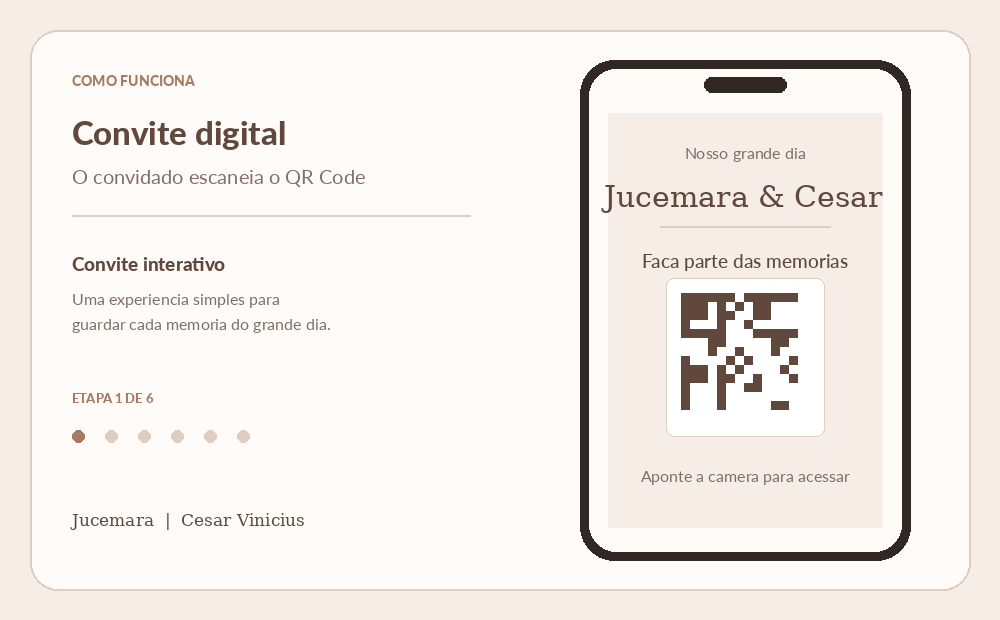

# Jucemara & César Vinicius

Convite interativo para o casamento, criado para que os convidados possam tirar uma foto pelo celular e compartilhá-la diretamente com os noivos.

## Como funciona



1. `index.html` exibe o convite e gera um QR Code.
2. O convidado acessa `camera.html` pelo celular.
3. O navegador solicita permissão para usar a câmera.
4. A câmera traseira ou frontal pode ser escolhida.
5. A foto é capturada ou selecionada da galeria e fica disponível para conferência.
6. Depois da confirmação, a imagem é comprimida e enviada para o Google Drive por meio do Google Apps Script.

> O GIF detalhado em `assets/como-funciona.gif` mostra esse fluxo: QR Code, permissão da câmera, escolha da câmera, captura, prévia e compartilhamento.

## Arquivos

| Arquivo | Função |
| --- | --- |
| `index.html` | Página inicial com o convite e o QR Code. |
| `camera.html` | Página de captura e seleção da foto. |
| `script.js` | QR Code, câmera, prévia, compressão e envio. |
| `style.css` | Estilos responsivos do convite. |

## Como executar

Como o acesso à câmera exige um contexto seguro, abra o projeto por `localhost` ou publique-o em um serviço com HTTPS.

### Opção 1: servidor local

Com Python instalado, execute na pasta do projeto:

```bash
python3 -m http.server 8000
```

Depois, acesse:

```text
http://localhost:8000/
```

### Opção 2: GitHub Pages

1. Envie os arquivos para um repositório no GitHub.
2. Abra `Settings > Pages`.
3. Em `Build and deployment`, selecione a branch `main` e a pasta `/root`.
4. Acesse o endereço gerado pelo GitHub Pages.

O QR Code é montado com o endereço atual da página, então ele deve ser gerado depois que o site estiver publicado.

## Configuração do Google Apps Script

O endpoint usado para receber as fotos está definido no início de `script.js`, na constante `GOOGLE_APPS_SCRIPT_URL`.

O Google Apps Script precisa:

- receber os campos `photo` e `fileName` via `POST`;
- converter o conteúdo Base64 em arquivo JPEG;
- salvar o arquivo na pasta desejada do Google Drive;
- estar publicado como aplicativo da web com acesso permitido aos convidados.

Antes de publicar o projeto, substitua a URL de exemplo pela URL da implantação do seu próprio Apps Script e evite versionar informações sensíveis.

## Tecnologias

- HTML5
- CSS3
- JavaScript puro
- `getUserMedia` para acesso à câmera
- QRCode.js para geração do QR Code
- Google Apps Script e Google Drive para armazenamento

## Créditos

Desenvolvido para registrar e compartilhar as memórias do grande dia de Jucemara & César Vinicius.
