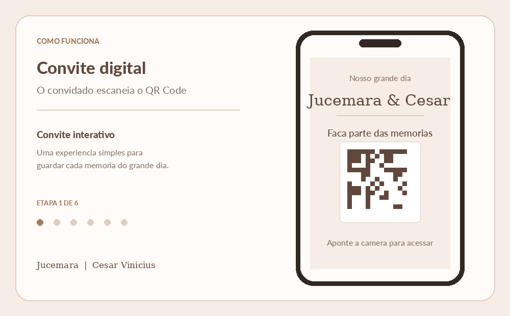

# Jucemara & César Vinicius

Convite de casamento interativo desenvolvido para proporcionar uma experiência moderna, funcional e memorável aos convidados. A proposta é simples: cada pessoa acessa a página pelo celular, tira ou seleciona uma foto e envia diretamente para os noivos em poucos segundos.

## Visão geral

O projeto combina uma interface elegante com uma experiência mobile fluida. Ele permite que os convidados participem do momento de forma prática e personalizada, sem precisar de um processo complexo.

## Como funciona

O projeto é dividido em duas partes:

1. `index.html` exibe o convite e gera o QR Code da página.
2. `camera.html` é a interface mobile usada para acessar a câmera, capturar a imagem e confirmar o envio.

Durante o fluxo, o usuário pode:

- escolher entre a câmera frontal e traseira;
- capturar uma nova foto ou selecionar uma da galeria;
- visualizar a imagem antes de confirmar o envio;
- comprimir a foto para reduzir o tamanho do arquivo;
- enviar a imagem diretamente para o Google Drive por meio do Google Apps Script.

> O GIF em `assets/como-funciona.gif` demonstra o fluxo completo: QR Code, acesso à câmera, captura, prévia e envio.

## Estrutura do projeto

| Arquivo | Função |
| --- | --- |
| `index.html` | Página inicial com o convite e o QR Code. |
| `camera.html` | Página de captura e envio da foto. |
| `script.js` | Lógica do QR Code, acesso à câmera, preview, compressão e envio. |
| `style.css` | Estilos responsivos da interface. |
| `assets/` | Imagens, animações e outros materiais visuais. |

## Como executar

Como o acesso à câmera exige um ambiente seguro, a aplicação deve ser aberta em `localhost` ou em um domínio com HTTPS.

### Opção 1: execução local

Use qualquer servidor estático para abrir o projeto.

No VS Code, uma opção prática é utilizar o Live Server:

1. Abra a pasta do projeto no editor.
2. Clique com o botão direito em `index.html`.
3. Selecione `Open with Live Server`.

Em seguida, acesse o endereço local gerado pelo navegador.

### Opção 2: publicação no GitHub Pages

1. Envie os arquivos para um repositório no GitHub.
2. Acesse `Settings > Pages`.
3. Em `Build and deployment`, selecione a branch principal e a pasta raiz.
4. Salve as alterações e acesse o link disponibilizado.

O QR Code é gerado com base no endereço atual da página, por isso deve ser criado após a publicação ou após a configuração correta do acesso.

## Configuração do Google Apps Script

O endpoint responsável por receber as fotos está definido no início de `script.js`, na constante `GOOGLE_APPS_SCRIPT_URL`.

O Google Apps Script precisa:

- receber os campos `photo` e `fileName` via `POST`;
- converter o conteúdo em Base64 em um arquivo JPEG;
- salvar a imagem na pasta desejada do Google Drive;
- estar publicado como aplicativo web com acesso permitido aos convidados.

Antes da publicação, substitua a URL de exemplo pela URL do seu próprio Apps Script e evite expor informações sensíveis no código.

## Tecnologias

- HTML5
- CSS3
- JavaScript puro
- `getUserMedia` para acesso à câmera
- QRCode.js para geração do QR Code
- Google Apps Script para recebimento das imagens
- Google Drive para armazenamento das fotos

Essas tecnologias foram escolhidas para manter o projeto leve, responsivo e funcional em dispositivos móveis, com uma interface prática e uma experiência agradável para os convidados.

## Créditos

Desenvolvido para registrar e celebrar os momentos mais especiais do grande dia de Jucemara & César Vinicius.

Criação e implementação da experiência digital com foco em entregar uma solução moderna e personalizada para esse momento único.
